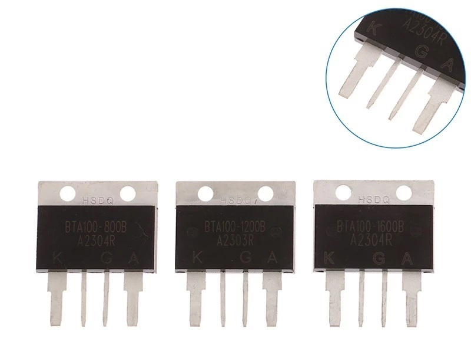

# Giới thiệu:
Triac **BTA100** được dùng nhiều trong các thiết bị công suất như máy hàn cell, bộ điều khiển tải AC… Tuy nhiên thị trường hiện có rất nhiều loại không rõ nguồn gốc, rất dễ mua nhầm hàng kém chất lượng. Dưới đây là kinh nghiệm rút ra từ quá trình test thực tế.

---

## 1. Hãng ST KHÔNG sản xuất BTA100  

Trên thị trường có nhiều BTA100 được khắc laze **logo hãng ST** (giả dạng hãng sản xuất linh kiện uy tín). Nếu thấy BTA100 in **logo ST**, cho dù chữ in sắc nét tới đâu thì **100% là hàng giả**. Vì dòng BTA100 **không hề** nằm trong danh mục sản phẩm của hãng STMicroelectronics.

---

## 2. BTA100 dập chìm HSDO

BTA100 có xuất xứ TQ, chủ yếu do hãng HSDO sản xuất. Loại này dập chìm **HSDO** không phải hàng giả, nhưng **chất lượng không đồng nhất**.  Mỗi shop nhập từ một nguồn khác nhau: có shop lấy loại 1, có shop lấy loại 2–3 nên chất lượng cũng khác nhau.

---

## 3. Loại BTA100 đề xuất

Qua quá trình mua thử nghiệm và kiểm chứng thực tế trong các máy hàn cell, mình và các anh em kỹ thuật đã xác định được một số nguồn BTA100 tốt và ổn định mà anh em có thể yên tâm tham khảo.

**🔗 Link sản phẩm:**  
- https://s.shopee.vn/4ArshrZxlQ

---

## 4. Lời khuyên nhanh  
- Không mua BTA100 logo **ST**  (vì hàng fake 100%)
- Với HSDO: chọn shop uy tín theo danh sách bên trên.
---

